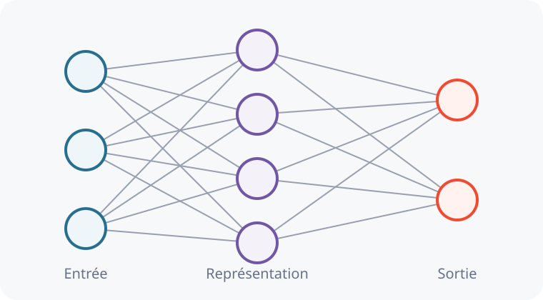
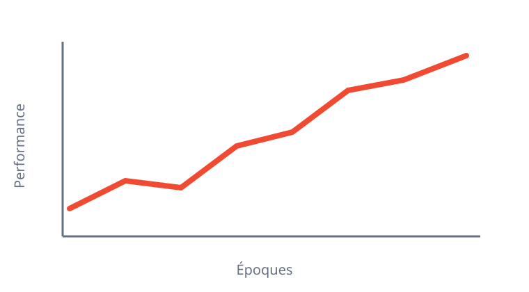
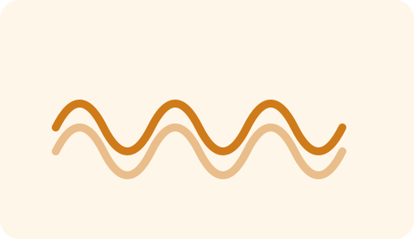
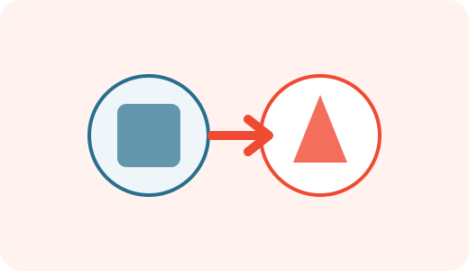
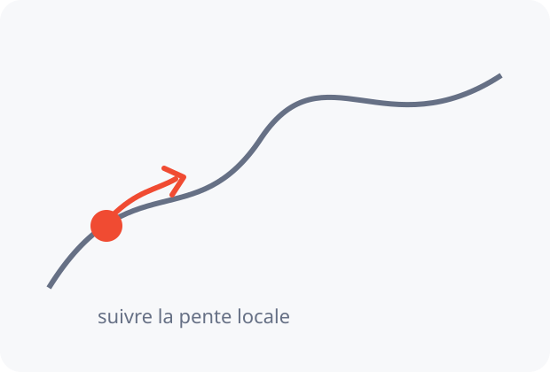

<!-- _class: title-academic institutional-cover -->

MARS v0.7.0

Marp Authoring & Rendering Studio

Design system et environnement auteur pour Marp

ENSA Khouribga · Université Sultan Moulay Slimane

Catalogue de référence

---

<!-- _class: chapter -->

# Blocs académiques

## Une sémantique stable sur tous les Decks

---

<!-- _class: content -->

# Définition et exemple

### Définition — Apprentissage supervisé

L'**apprentissage supervisé** consiste à apprendre une fonction

$$
f_\theta : \mathcal X \rightarrow \mathcal Y
$$

à partir d'exemples étiquetés.

### Exemple

Reconnaître la classe d'une image à partir d'exemples annotés.

---

<!-- _class: content -->

# Théorème, propriété et preuve

### Théorème

Énoncé d'un résultat mathématique central.

### Propriété

Une propriété utile du modèle ou de l'algorithme.

### Preuve

On applique la règle de chaîne : $\frac{dy}{dx}=\frac{dy}{dz}\frac{dz}{dx}$.

---

<!-- _class: content -->

# Remarque, exercice et synthèse

### Remarque

Cette hypothèse n'est pas nécessaire dans le cas général.

### Exercice

Calculer la sortie pour $x=(1,2)$, $w=(0.5,-1)$ et $b=1$.

### À retenir

Le **layout** organise la slide ; le **bloc** exprime son rôle pédagogique.

---

<!-- _class: content -->

# Avertissement

### Attention

Ne pas confondre **fonction d'activation** et **fonction de perte** : elles n'ont ni le même rôle ni la même place dans le modèle.

### Remarque

Le bloc `warning` signale un piège conceptuel ou une erreur fréquente ; il ne remplace pas un bloc `remark`.

---

<!-- _class: chapter -->

# Layouts fondamentaux

## Huit structures reproductibles en v0.3.0

---

<!-- _class: figure-right -->

# Figure à droite

Une slide `figure-right` réserve davantage d'espace au texte tout en garantissant une zone visuelle stable.

### À retenir

Aucun ajustement CSS par slide.

Exemple de représentation d'un réseau.

---

<!-- _class: figure-left -->

# Figure à gauche

Le même contrat HTML est utilisé. Seule la classe de la slide change.

- structure stable ;
- image dimensionnée automatiquement ;
- texte libre à droite.

---

<!-- _class: two-columns -->

# Deux colonnes

## Apprentissage

- données
- fonction de perte
- optimisation

## Inférence

- nouvelle observation
- passage avant
- prédiction

---

<!-- _class: comparison -->

# Machine Learning traditionnel vs Deep Learning

## Traditionnel

- caractéristiques conçues à la main ;
- classifieur appris ;
- pipeline fragmenté.

## Deep Learning

- représentations apprises ;
- classifieur appris ;
- entraînement end-to-end.

---

<!-- _class: diagram -->

# Pipeline

Un diagramme exprime une succession d'étapes ou une architecture simple.

Entrée

Image

→

Conçu manuellement

Caractéristiques

→

Appris

Classifieur

Le message final est séparé du pipeline pour rester lisible à distance.

---

<!-- _class: figure-full -->

# Figure dominante

Utiliser ce layout quand la figure porte l'essentiel du message.

---

<!-- _class: equation-focus -->

# Équation centrale

$$
y = \sigma(Wx+b)
$$

Wpoids appris

bbiais

σactivation

---

<!-- _class: chapter -->

# Layouts spécialisés

## Dix structures supplémentaires en v0.3.0

---

<!-- _class: architecture -->

# Architecture

<strong>Entrée</strong>
Pixels

→

<strong>Conv + ReLU</strong>
Caractéristiques locales

→

<strong>Représentation</strong>
Caractéristiques de haut niveau

→

<strong>Sortie</strong>
Classe prédite

Pour CNN, MLP, autoencodeurs, Transformers ou tout modèle composé de blocs.

---

<!-- _class: algorithm -->

# Algorithme

<strong>Entrée :</strong> données D, taux η

<strong>Sortie :</strong> paramètres θ

1. Initialiser $\theta$.
2. Calculer la perte $L(\theta)$.
3. Calculer $\nabla_\theta L$.
4. Mettre à jour les paramètres.

$$
\theta \leftarrow \theta - \eta\nabla_\theta L
$$

Séparer la procédure de ses hypothèses, propriétés de convergence ou remarques d'implémentation.

---

<!-- _class: math-derivation -->

# Dérivation mathématique

1

Composition : $y=f(g(x))$.

2

Règle de chaîne :

$$
\frac{dy}{dx}=\frac{df}{dg}\frac{dg}{dx}.
$$

3

On applique la relation couche par couche dans le réseau.

La rétropropagation est une application structurée de la règle de chaîne.

---

<!-- _class: timeline -->

# Frise chronologique

1943McCulloch–PittsNeurone formel

1958PerceptronRosenblatt

1986BackpropRenaissance des MLP

1998LeNetCNN pour les chiffres

2012AlexNetRupture ImageNet

---

<!-- _class: gallery gallery-4 -->

# Galerie d'applications

<h3>Vision</h3>

Classification, détection, segmentation

<h3>Langage</h3>

Compréhension et génération

<h3>Audio</h3>

Reconnaissance de la parole

<h3>Génération</h3>

Images et représentations apprises

---

<!-- _class: experiment -->

# Résultat expérimental

Une figure principale, lisible à distance.

## Observation

+18 %<small>gain relatif sur la métrique étudiée</small>

Le panneau latéral sert à exprimer **le résultat**, pas à répéter le graphique.

---

<!-- _class: motivation -->

# Motivation

Et si, au lieu d'écrire toutes les règles, nous pouvions **les apprendre à partir des données** ?

Une slide de motivation introduit le problème avant le vocabulaire et le formalisme.

---

<!-- _class: question -->

# Question

Pourquoi la **profondeur** peut-elle améliorer les représentations apprises ?

Utiliser cette slide comme rupture pédagogique avant une nouvelle notion.

---

<!-- _class: intuition -->

# Intuition avant formalisme

La descente de gradient ressemble à une marche sur un paysage dont on ne connaît que la **pente locale**.

On choisit une direction qui réduit localement la fonction objectif, puis on recommence.

---

<!-- _class: take-home -->

# À retenir

01Un <strong>layout</strong> fixe la géométrie de la slide.

02Un <strong>bloc</strong> encode le rôle pédagogique du contenu.

03Le CSS spécifique reste réservé aux besoins réellement nouveaux.

---

<!-- _class: content -->

# Crédit de source

Une source directement utilisée sur une slide peut être indiquée discrètement sans surcharger le contenu.

Adapté de : Auteur, titre du cours ou de la publication.

---

<!-- _class: references -->

# Références

<strong>Yann LeCun & Alfredo Canziani</strong> Deep Learning, NYU Center for Data Science.

<strong>Charles Deledalle</strong> Machine Learning for Image Processing, UCSD ECE 285.

<strong>Sebastian Raschka</strong> STAT 453 — Introduction to Deep Learning.

---

<!-- _class: content -->

# Règle de conception

### Principe MARS

Une nouvelle slide doit d'abord utiliser un **layout existant** et des **blocs existants**.

On ne crée un nouveau CSS que lorsqu'un besoin réellement nouveau devient **réutilisable**.

